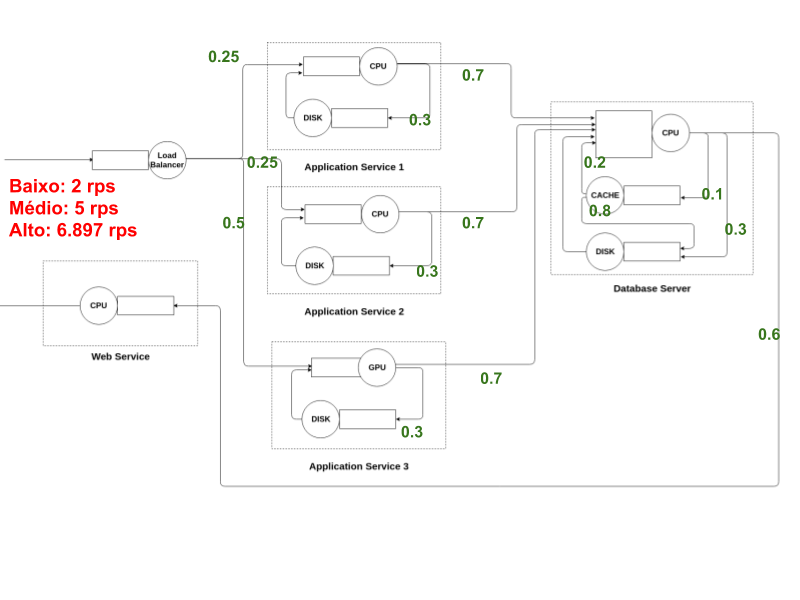

## Miniteste de validação

### Comparação dos resultados

[Comparação dos resultados](https://docs.google.com/document/d/1BGAIX-sUIIddSweY2hcpWGHzNDtnFRXyqQuQo0CSb6A/edit?usp=sharing)

### Execução no Arena

[Arquivo do arena](projeto_simulacao.doe)

* Baixa utilização: 5 repetições de 500 segundos.  [Relatório geral](relatorio_baixa_utilizacao.pdf), [Relatório por replicação](relatorio_baixa_utilizacao_por_replicacao.pdf)

* Media utilização: 3 repetiçoes de 500 segundos com 50 segundos para "warm up".  [Relatório geral](relatorio_media_utilizacao.pdf), [Relatório por replicação](relatorio_media_utilizacao_por_replicacao.pdf)

* Alta utilização: 5 repetições de 500 segundos.  [Relatório geral](relatorio_alta_utilizacao.pdf), [Relatório por replicação](relatorio_alta_utilizacao_por_replicacao.pdf)

### Análise teórica

[Planilha](https://docs.google.com/spreadsheets/d/1KK3jnpUGgVE60ANYHrTs-AsMMCpsDKjN3uIoQcxbrcA/edit?usp=sharing)

